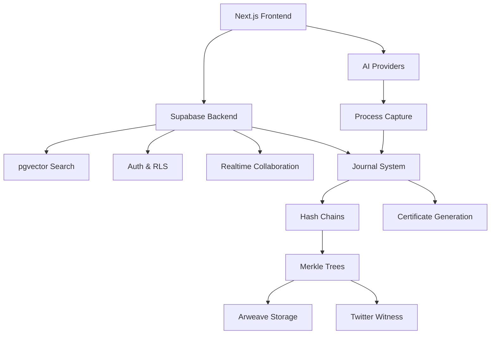

# VERDENT.md
This file provides guidance to Verdent when working with code in this repository.

## Table of Contents
1. Commonly Used Commands
2. High-Level Architecture & Structure
3. Key Rules & Constraints
4. Development Hints

## Commands
- `npm install` [inferred]
- `npm run dev` - Start development server [inferred]
- `npm run build` - Build for production [inferred]
- `npm run type-check` - TypeScript validation [inferred]
- `npm run lint` - ESLint validation [inferred]
- `npx supabase start` - Start local Supabase development [inferred]
- `npx supabase db push` - Apply schema changes [inferred]
- `npx supabase gen types typescript --local` - Generate TypeScript types [inferred]

## Architecture

### Major Subsystems & Responsibilities
- **Frontend (Next.js 15 + React 19)**: AI-native editor with Lexical, command palette interface, real-time collaboration
- **Process Journal System**: Automatic capture of AI interactions, inline annotations, privacy levels (private/summary/public)
- **Immutability Layer**: Hash chains, Merkle trees, blockchain checkpointing via Arweave/Twitter
- **Supabase Backend**: PostgreSQL + pgvector for semantic search, Auth, Storage, Realtime collaboration
- **AI Integration**: Multi-model support (OpenAI GPT-5-mini, Claude 4 Sonnet) with streaming responses

### Key Data Flows
- **Journal Creation**: Document creation → Journal initialization → Entry capture → Hash chain building
- **AI Interaction**: User prompt → AI provider → Response capture → Journal entry → Embedding generation
- **Verification**: Journal entries → Merkle tree → Checkpoint → Blockchain witness → Certificate generation
- **Privacy Preservation**: Full journal → AI summary → Public/summary view → Selective disclosure

### External Dependencies
- **Supabase**: Database, auth, storage, realtime, edge functions
- **Arweave**: Permanent blockchain storage for checkpoints
- **Twitter API**: Free checkpointing witness service
- **OpenAI**: GPT-5-mini for summaries, embeddings via text-embedding-3-small
- **Anthropic**: Claude 4 Sonnet for writing assistance
- **Vercel**: Edge Runtime hosting platform

### Development Entry Points
- `app/` - Next.js App Router pages and layouts [inferred]
- `components/` - React components including Lexical editor [inferred]
- `lib/` - Utilities for journal capture, hash chains, AI integration [inferred]
- `supabase/` - Database schema, edge functions, types [inferred]

### Subsystem Relationships

## Key Rules & Constraints

### Core Principles from Manifesto
- **Transparency over detection**: Celebrate human thinking rather than catching AI use
- **Process has value**: The journey of thought is as meaningful as the final product
- **Immutable append-only logs**: Trust through cryptographic verification, not surveillance
- **Privacy-preserving**: Prove process without revealing proprietary prompts
- **Natural workflow**: Invisible capture that doesn't disrupt creative flow

### Technical Implementation Constraints
- **Hash chain integrity**: Each journal entry must include previous hash for verification
- **Merkle checkpoint frequency**: Generate Merkle roots every 10 journal entries
- **Privacy levels**: Support private/summary/public with selective disclosure
- **Row Level Security**: Use Supabase RLS policies for data access control
- **Vector embeddings**: Generate embeddings for all journal content for semantic search
- **Multi-model AI**: Support both OpenAI and Anthropic with consistent interface

### Development Phases Priority
1. **MVP (1 week)**: Supabase setup, basic Lexical editor, journal capture, local hash chain
2. **Alpha (2 weeks)**: pgvector semantic search, AI summaries, Twitter checkpointing, public views
3. **Beta (3 weeks)**: Arweave integration, certificate generation, realtime collaboration, voice annotations
4. **Launch (4 weeks)**: Performance optimization, publisher dashboard, API integrations

### Database Schema Requirements
- All journal tables must use UUID primary keys
- `journal_entries` table must be append-only with sequence numbers
- Use `vector(1536)` for OpenAI text-embedding-3-small embeddings
- Implement automatic sequence numbering via database triggers
- Certificate data must be stored as JSONB for flexible verification

## Development Hints

### Adding a New Journal Entry Type
- Update `entry_type` CHECK constraint in `journal_entries` table
- Add type-specific metadata handling in journal capture logic
- Implement embedding generation for new content type
- Update privacy filtering for new entry type in RLS policies

### Implementing AI Provider Integration
- Use AI SDK (@ai-sdk/openai, @ai-sdk/anthropic) for consistent streaming interface
- Implement token counting with tiktoken for cost management
- Store provider-specific metadata in journal entry metadata JSONB field
- Generate embeddings immediately after AI response for semantic search

### Setting Up Semantic Search
- Use pgvector extension with `vector(1536)` for OpenAI embeddings
- Create IVFFLAT indexes on embedding columns for performance
- Implement cosine similarity search with configurable threshold (0.78 default)
- Generate embeddings via Supabase Edge Functions to keep API keys secure

### Blockchain Verification Implementation
- Build Merkle trees using `merkletreejs` library with SHA-256 hashing
- Store witness proofs as transaction IDs (Arweave) or Tweet IDs (Twitter)
- Implement selective disclosure using Merkle proofs for privacy
- Use `@noble/hashes` for cryptographic operations, `tweetnacl` for signatures

### Supabase Edge Function Patterns
- Use Edge Functions for embedding generation to secure API keys
- Implement checkpoint creation logic in Edge Functions for atomic operations
- Use database triggers for automatic sequence numbering and hash chain updates
- Leverage Supabase Realtime for collaborative journal features

### Certificate Generation & Export
- Store certificates as JSON-LD with cryptographic signatures
- Generate public URLs for shareable certificate verification
- Include Merkle root references for blockchain verification
- Support selective disclosure of journal entries in certificates

### Privacy-Preserving Summary Generation
- Use AI to generate summaries that show process without revealing content
- Focus on decisions, revisions, and thinking evolution in summaries
- Store summary embeddings separately for discovery without content exposure
- Implement privacy level transitions (private → summary → public)